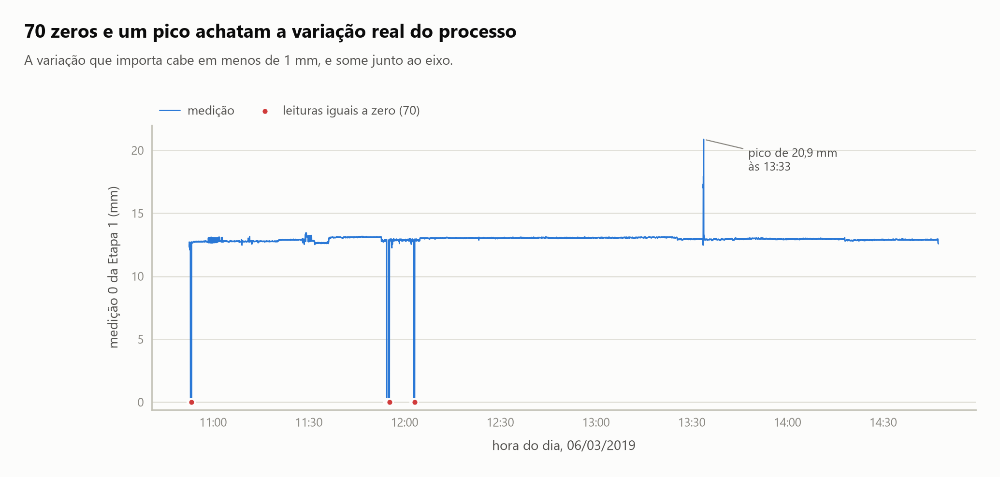
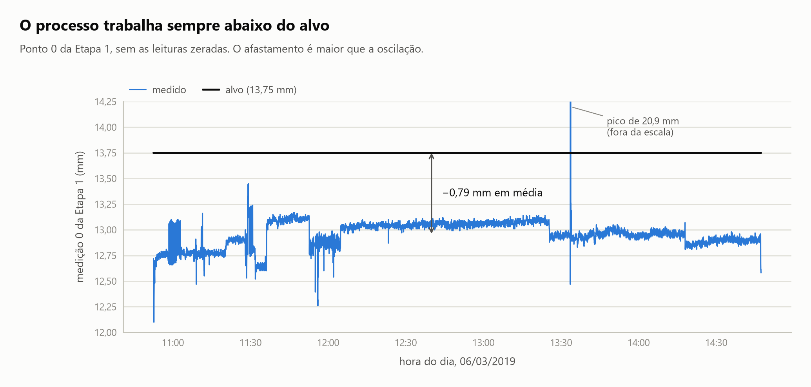
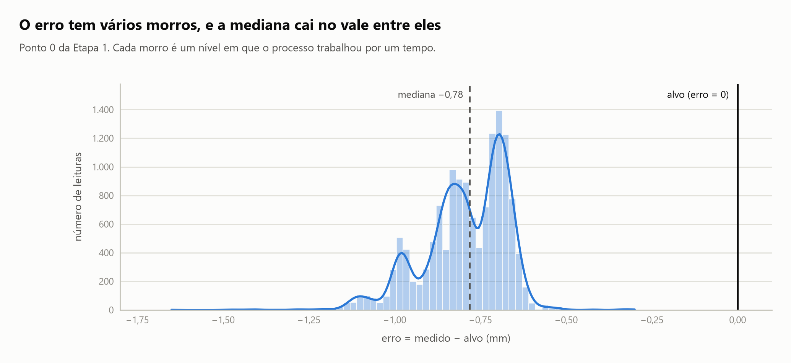
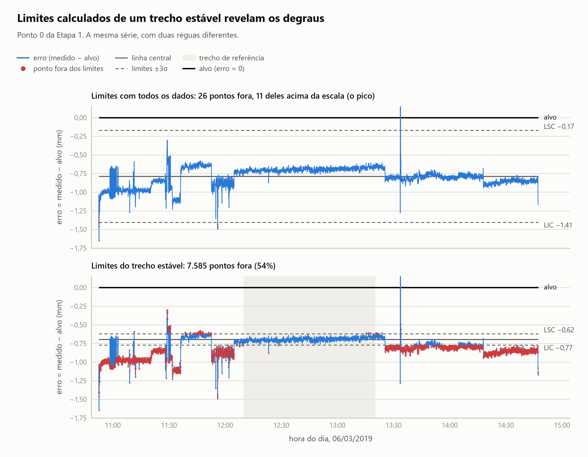
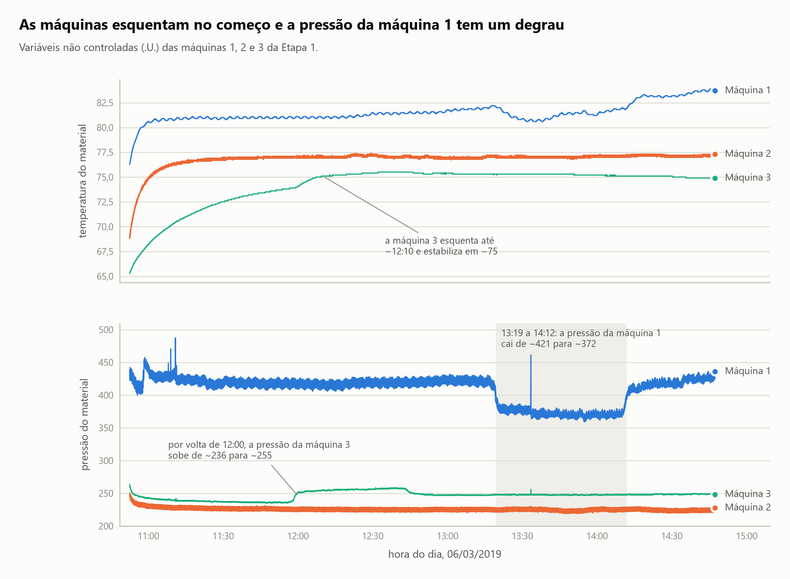
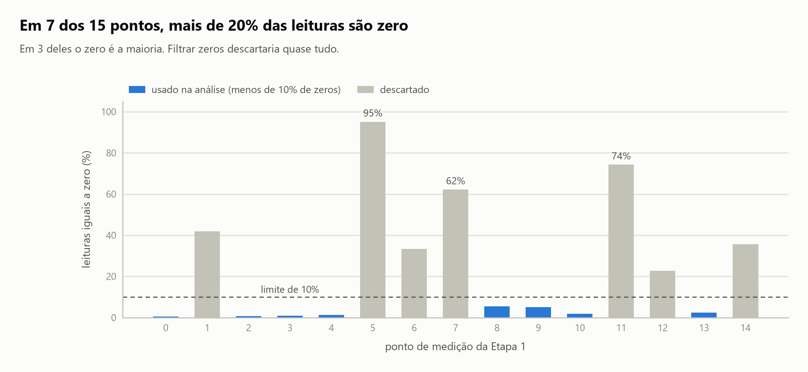
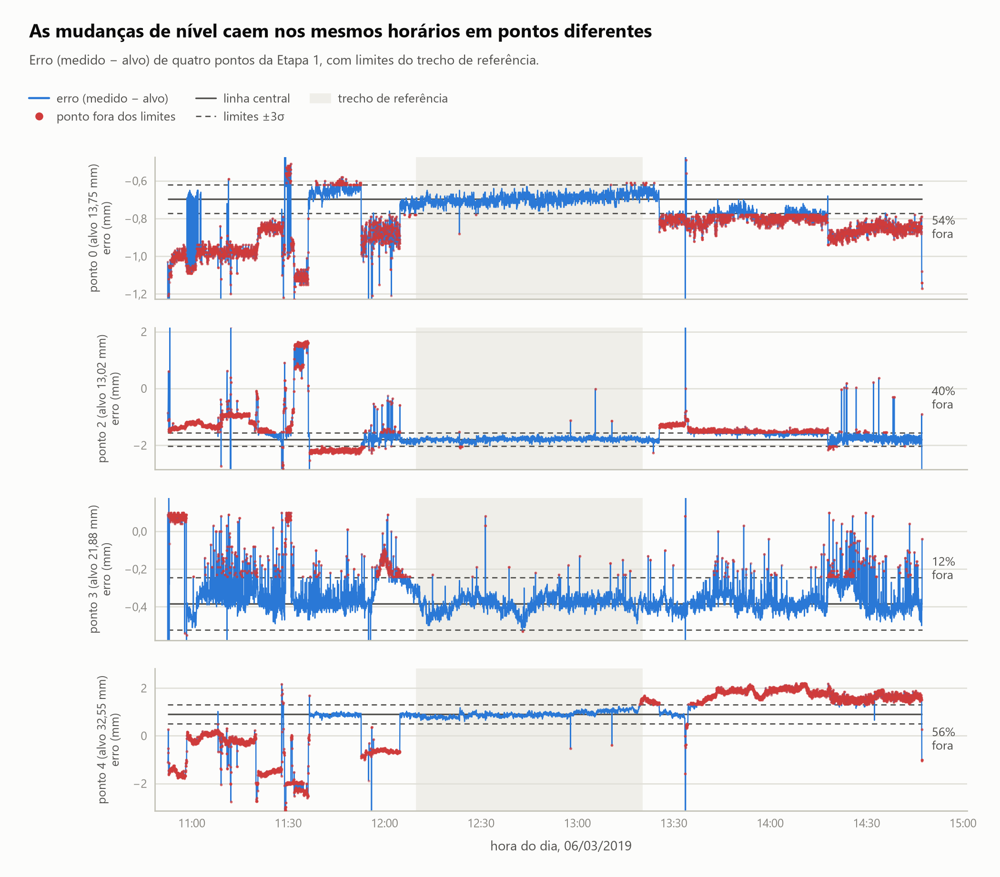

# P05. Visualização de variáveis de processo

**Nº 5 de 49 na ordem de execução.** ID do projeto: P05.

**Cursos da Alura a fazer antes deste projeto (todos os que caem aqui na ordem das 4 carreiras):**
- CD/N1-06 a 08 — Data Visualization com bibliotecas Python (criação; comparação e distribuição; composição e relação)
- AD/N1-01 — Trabalhando com dados: fundamentos da análise de dados

Uma corrida real de uma linha de produção de duas etapas, vista só por gráficos. Quero responder três
coisas: o processo está no alvo, ele se mantém estável ao longo do tempo, e que variáveis de máquina
mudam junto com ele. O centro do projeto é uma carta de controle que compara cada medição com o alvo da
máquina. O gráfico de cada etapa foi escolhido pela pergunta que ele responde.

## Os dados

*Multi-stage continuous-flow manufacturing process* (Kaggle, `supergus`), manufatura de fluxo contínuo:
<https://www.kaggle.com/datasets/supergus/multistage-continuousflow-manufacturing-process>.
É uma corrida de cerca de 4 horas (10:52 às 14:47 de 06/03/2019), com uma leitura por segundo, 14.088
linhas e 116 colunas. O fornecedor não identifica a empresa nem o setor, o dado é anonimizado.

A Etapa 1 tem três máquinas em paralelo que alimentam um combinador, e a saída dele é medida em 15
pontos (em mm). A Etapa 2 tem duas máquinas em série, com mais 15 pontos. Cada ponto de medição vem
com duas colunas: o valor medido (`.Actual`) e o alvo (`.Setpoint`). Nas variáveis das máquinas, `.C.`
é variável controlada (presa num valor fixo) e `.U.` é não controlada. Uso a Etapa 1. O CSV não vai no
repositório (ver `.gitignore`).

## Os gráficos

No ponto 0 da Etapa 1 (alvo de 13,75 mm), 70 leituras iguais a zero e um pico de 20,9 mm esticam o eixo
até a variação real, de menos de 1 mm, sumir. Os zeros saem, porque uma peça de 13 mm não vai a 0 mm de
um segundo para o outro. O pico fica: é uma leitura plausível e anormal, o tipo de ponto que a carta de
controle existe para acusar.



Sem os zeros, o processo trabalha sempre abaixo do alvo. O erro (medido − alvo) tem média de −0,79 mm,
cerca de 6% do alvo. As leituras não se espalham ao acaso em torno de 13,75, elas se deslocam para o
mesmo lado: erro sistemático, não aleatório.



O histograma do erro tem pelo menos três morros, perto de −0,70, −0,83 e −0,98, e a mediana (−0,78) cai
no vale entre dois deles. Cada morro é um patamar em que o processo trabalhou por um tempo.



Na carta de controle, o resultado depende de onde saem os limites. Com limites de ±3σ calculados de todos
os dados, a carta acusa 26 pontos em quase 4 horas (o pico de 13:33 e transitórios de partida) e nenhum
dos degraus. Calculando os limites de um trecho estável (12:10 às 13:20) e aplicando à corrida inteira, o
sigma cai de 0,21 para 0,025 e 54% das leituras ficam fora, com as mudanças de nível aparecendo.



Para procurar o que mudou, olhei a temperatura e a pressão das máquinas. As três esquentam no começo, e a
máquina 3 só estabiliza perto de 12:10. A pressão da máquina 1 cai de ~421 para ~372 entre 13:19 e 14:12,
e a da máquina 3 sobe de ~236 para ~255 por volta de 12:00. Os horários se encaixam com as mudanças de
nível do erro, o que aponta para uma hipótese, não uma causa provada.



Antes de estender a análise para outros pontos, conferi a premissa de que zero é falha. Em 7 dos 15
pontos da Etapa 1, mais de 20% das leituras são zero, e em 3 deles zero é a maioria (o ponto 5 tem 95%).
Usei só os 8 pontos com menos de 10% de zeros.



Com a mesma régua em quatro pontos, as mudanças de nível aparecem nos mesmos horários nos pontos 0, 2 e
4, e o pico de 13:33 aparece nos quatro. Cada ponto conta uma história diferente: o ponto 3 é o mais
próximo do alvo mas muda de variabilidade, e o ponto 4 atravessa o zero, de abaixo para acima do alvo.



## Resultado

O processo não está no alvo: no ponto 0 o erro é sistemático, de −0,79 mm em média, e no ponto 2 é de
−1,59 mm (12% do alvo). Também não é estável, porque trabalha em patamares que mudam em horários
específicos, e uma carta de controle com limites de todos os dados não enxerga isso. As mudanças aparecem
alinhadas em vários pontos e coincidem com degraus de pressão nas máquinas 1 e 3, o que sugere uma causa
comum, a testar.

## Limitações

O trecho de referência (12:10 às 13:20) foi escolhido por mim, a olho, e o sigma dele vem de uma hora
particularmente calma. O "54% fora" depende dessa escolha: um patamar estável em outro nível cruza limites
tão apertados só por estar em outro nível. Um sigma robusto a picos (pela mediana dos desvios) seria a
próxima comparação. Os limites são calculados e avaliados nos mesmos dados, sem uma segunda corrida para
validar. Leituras a 1 Hz são correlacionadas entre si e a distribuição não é normal, então os 0,27% de
alarme falso do 3σ valem só como referência.

Não sei a causa dos zeros nem dos picos (parada de linha e falha de leitura são hipóteses), e não afirmo.
O mesmo vale para a relação entre pressão e erro: é coincidência de horário, sem teste. Um mapa de
correlação simples não resolveria, porque séries com tendência (o aquecimento) parecem correlacionadas só
porque sobem juntas com o tempo.

É uma corrida só, de 4 horas. Analisei a Etapa 1: a Etapa 2 (mais ruidosa, segundo a documentação do
dataset) e 7 dos 15 pontos ficaram de fora.

## Como rodar

```bash
pip install -r requirements.txt
# baixar o CSV do Kaggle (link acima) e salvar como data/continuous_factory_process.csv
jupyter notebook notebooks/P05_visualizacao_processo.ipynb
```

O notebook importa `notebooks/estilo.py`, que guarda só a aparência dos gráficos (cores, fontes, eixo de
tempo, salvamento das figuras). A análise fica no notebook. As figuras são salvas em `images/`.

O próximo projeto do portfólio usa este mesmo dataset e publica esses gráficos como dashboard no
Streamlit, com filtro por máquina, estágio e período.
